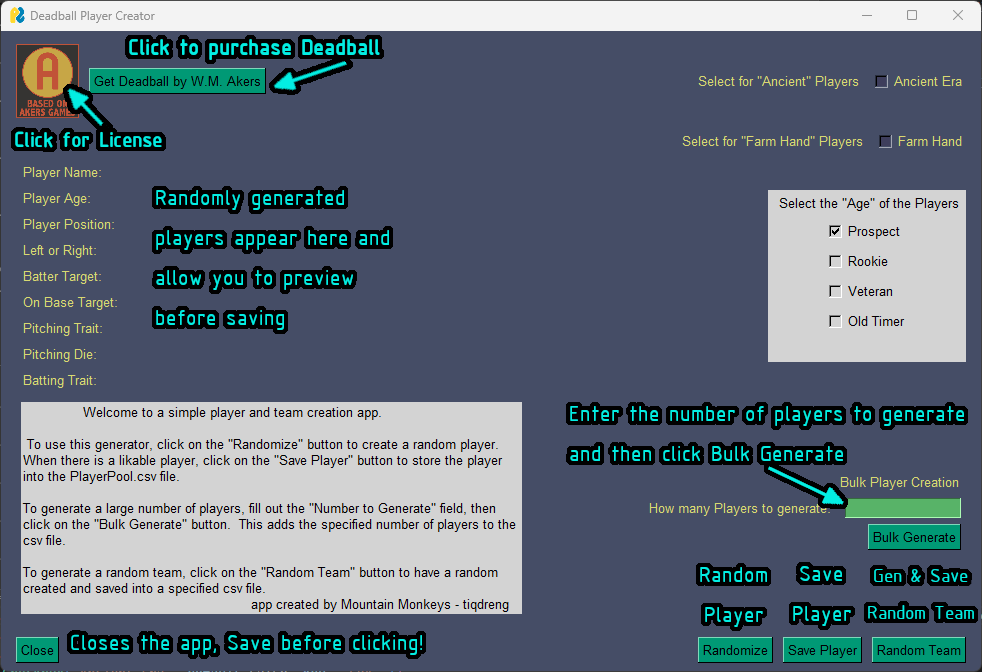

# The Deadball Player Generator

This is a simple program, written in Python3, that will generate a random ball player for the RPG _**Deadball**_ by _**W.M.Akers**_ { https://wmakers.net/deadball }.  It has the option to save the player to a csv file, **C**omma **S**eparated **V**alues, or you can copy it directly to a roster.  In addition to a single player, the program can generate a vast number of players to create a talent pool using _**Bulk Generate**_, and has the option to create a _**Random Team**_.

## Prerequisites and Installation

This program requires python 3 to be installed. https://www.python.org/downloads/

To install the required modules, open a terminal/command prompt and go to the Deadball directory then use:

pip install -r requirements.txt

or

python -m pip install -r reuirements.txt

Once PySimpleGui is installed, the program is run by:

python PlayerStats.py

## The Main Program Window

Here is the main window for the program.  In the top left is a link that will take you to the DriveThruRPG page to purchase Deadball in its current and second edition.  Underneath this button is where a single player's stats will be displayed after generation.  Below that is a text box that has very coarse and simple instructions on using the program.

On the right hand side are a few check boxes for the type of ball league to generate for.  The program defaults to the _Modern Era_ and by clicking on the check box it will generate the _Ancient Era_ ball players.  Just below that is an option to generate a _Farm Hand_ player as well.

When selecting the _Age_ of the generated player, be aware that only **one** of the options can be selected.  There is an error message that will display if more than one, or no options are selected.  This also applies to the _Bulk Generate_ option.

_Bulk Generate_ does exactly that.  It will generate the number of players entered into the input field, and will append that list to the _**PlayerPool.csv**_ file.  This allows for the ability to hold a "draft" party where all participants can pick from the pool in turns.

### The Main Buttons

_**Bulk Generate**_ : Clicking this will generate the number of random players entered into the input field

_**Randomize**_ : This generates a random player and displays their information in the program window

_**Save Player**_ : This will append the currently displayed player to the _**PlayerPool.csv**_ file

_**Random Team**_ : This will generate a random team and once finished will prompt for a filename to save the team to

## Additional Files

_**README.md**_ : This document in its source format

_**README.pdf**_ : The compiled PDF of this document

_**firstNames.txt**_ : This is the first name file list that can be modified to include any first name that you might want to use

_**surnames.txt**_ : This is the last name file list that can be modified to include any last name that you might want to use

_**PlayerPool.csv**_ : This is the player pool list in which players can be "drafted" from for your team

_**PlayerPool.xlsx**_ : This is a Microsoft Excel file that pulls in the data from the PlayerPool.csv so that the csv file can still be updated by the program.  It is merely here as a simple addition to help speed up the flow a bit and is not necesary if you don't want to use it.  It also allows for a quick view of how the data can be viewed in a spreadsheet application
